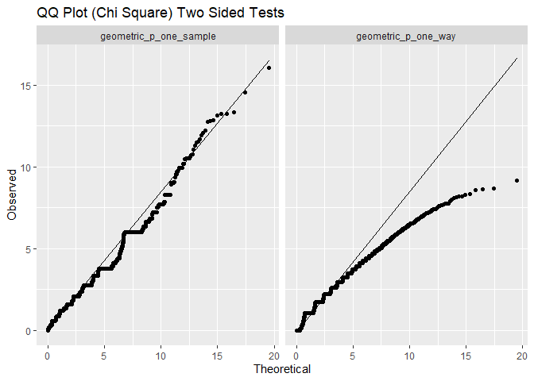

# Repo Overview

The likelihood ratio test’s asymptotic sampling distribution occurs when
two conditions are true:

- N approaches infinity. (1)
- The tested parameter is not close to the boundary. (2)

For the geometric distribution, satisfying the first condition causes
the second condition to be violated. This repo explores how this affects
the asymptotic sampling distributions and type I error rates.

# Geometric Distribution

### An Example

The geometric distribution gives then the probability of the number of
failures until the first success. As an example, imagine selling fruit
door-to-door. If there is a 15% chance a home owner purchases, what is
the probability of needing to visit 11 homes for the first sell?

``` r
round(dgeom(x = 10, prob = .15), 3)
#> [1] 0.03
```

What is the probability of needing to visit 11 or more homes for the
first sell?

``` r
round(pgeom(q = 10, prob = .15, lower.tail = FALSE), 3)
#> [1] 0.167
```

Note there are a few definitions of geometric distribution. R’s
probability functions count the number of failures before the first
success. Other definitions count the number of independent trials. Hence
10 and not 11 in the code.

### Asymptotic Theory

Intuitively, if the first home owner purchases the probability of
purchase is high. Roughly,a small N implies p is much larger than zero.
Condition 2 is satisfied and condition 1 is violated.

If one thousand homes are visited before the first purchase, the
probability of purchase is low. Roughly, a large N implies p is near or
equal to zero. Condition 1 is satisfied and condition 2 is violated.

This means satisfying one condition for the asymptotic $\chi^2$ sampling
distribution causes the other condition to be violated.

# Sampling Distribution

### Simulation Process

- Step 1: Generate the number of failures with a given probability of
  success.
- Step 2: Calculate likelihood test statistic.
- Step 3: Repeat for b 1 to 10,000.
- Step 4: Repeat with probability of success between .05 and .95.

The simulation is done for a one sample test and a two sample test.

### Results: Sampling Distribution

For both the one sample case and the two sample case, the sampling
distribution of the test statistic does not follow the $\chi^2$
distribution.



### Results: Type I Error Rate

For the likelihood tests, p values are calculated under the assumption
the test statistic follows a $\chi^2$ distribution. Considering this is
not true, what is the type I error rate?


In general, type I error rates are below the target .05 percent.
Interestingly, the likelihood test is closer to the target .05 than the
exact test.

The exact test fails to have exactly .05 type I error rate because the
test statistic (number of failures) is discrete and not continuous.
